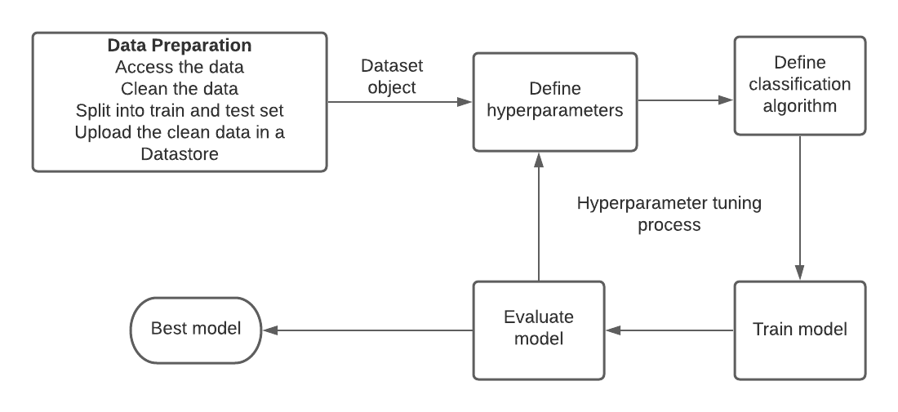
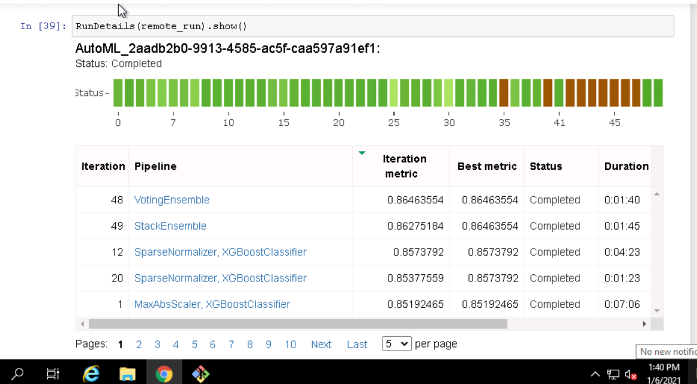
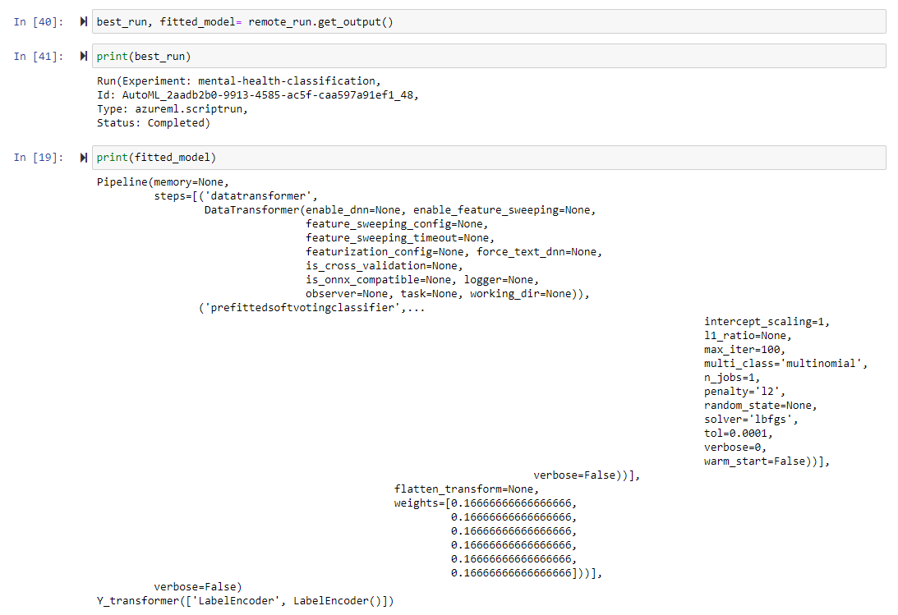
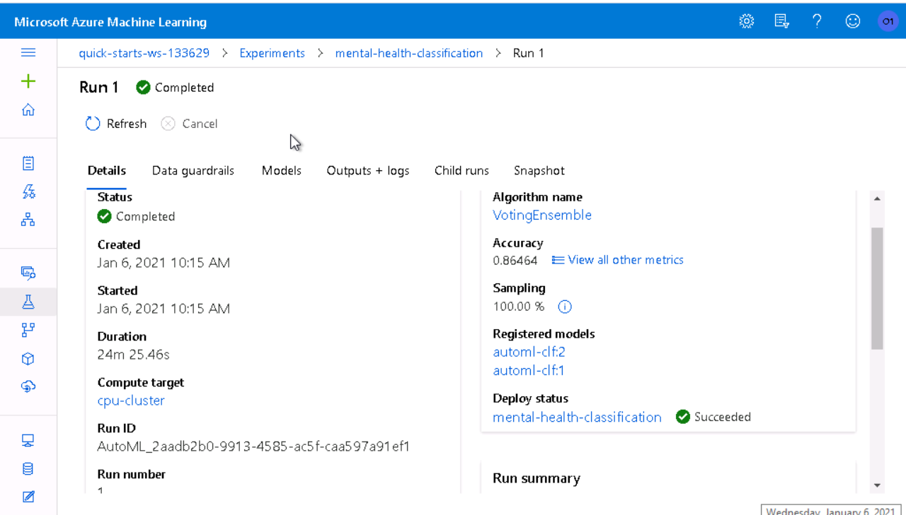
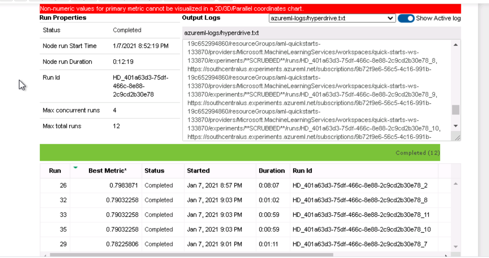
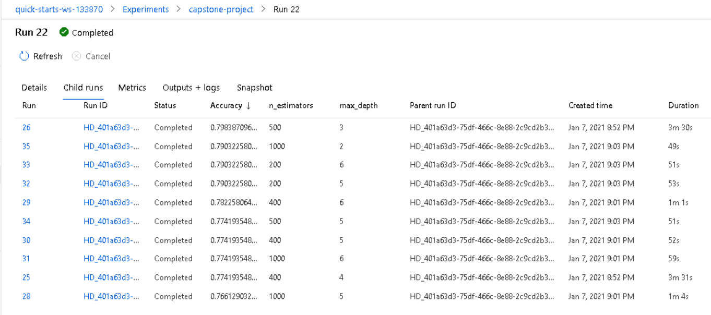
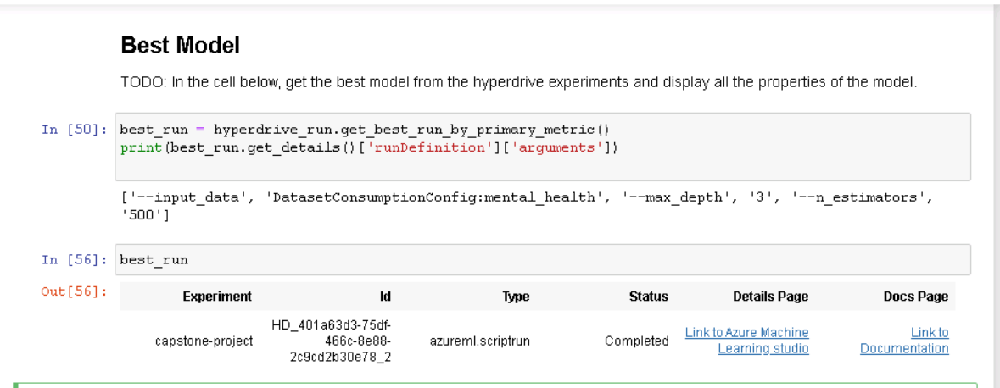
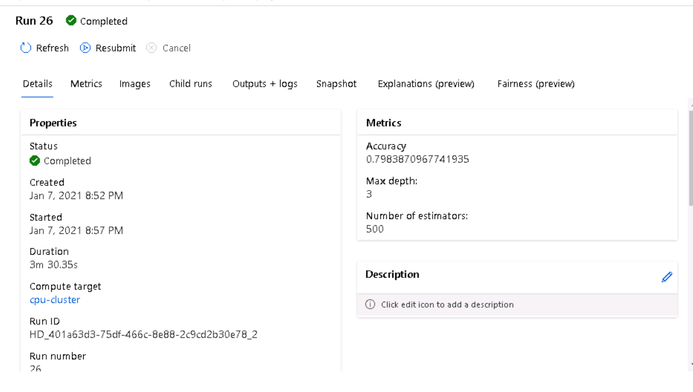
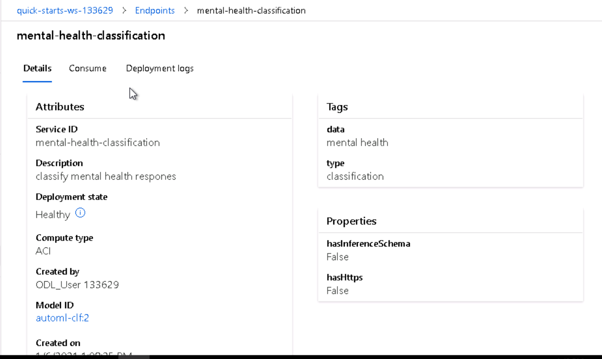
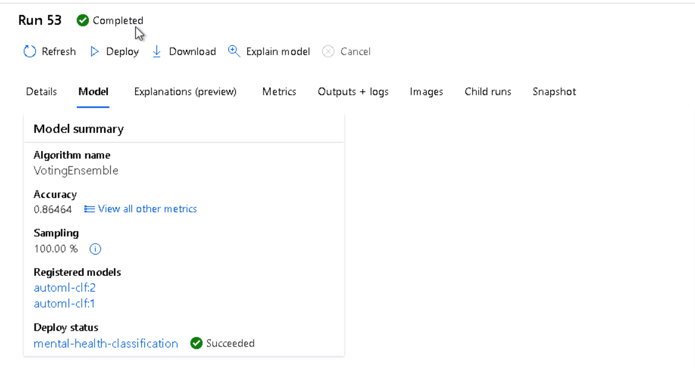

# Mental Health Classification

## Table of Contents

- [Mental Health Classification](#mental-health-classification)
  * [Project Overview](#project-overview)
  * [Repository structure](#repository-structure)
  * [Project Set Up and Installation](#project-set-up-and-installation)
  * [Dataset](#dataset)
    + [Overview](#overview)
    + [Task](#task)
    + [Access](#access)
  * [Automated ML](#automated-ml)
    + [Results](#results)
    + [Model explaianability](#model-explaianability)
  * [Hyperparameter Tuning](#hyperparameter-tuning)
    + [Results](#results-1)
  * [Model Deployment](#model-deployment)
  * [Future Improvement](#future-improvement)
  * [Screen Recording](#screen-recording)
  * [Standout Suggestions](#standout-suggestions)

## Project Overview

This mental health classification project is based on [this competition](https://zindi.africa/competitions/basic-needs-basic-rights-kenya-tech4mentalhealth) that was hosted on Zindi. I want to classify statements and expressions of university students into four mental health categories; depression, suicide, alcohol and drugs. This could be useful in providing quick services online such as in chatbots. 

Unlike in the competition, I generate the class predictions instead of the probabilities. 

The model is deployed in an ACI instance and available for inferencing via a http REST endpoint. The deployed model enpoint takes care of everything including data transformation to a form that is ready for prediction by the machine learning model. You can send both a one observation or multiple observations for inference. 

Below is the project architecture.



## Repository Structure
The following folders exist: 
 - data : contains train and test data
 - screenshots : contains required screenshots of the experiment results
 - deployed_environment : contains the details on the deployed environment


## Project Set Up and Installation

1. Upload the data and notebooks and the train script in the notebook section of the ML studio. If you upload them in any other folder other than the default folder, make sure you change the path inside the notebooks.
2. Run

## Dataset

### Overview

The data is obtained from [this competition](https://zindi.africa/competitions/basic-needs-basic-rights-kenya-tech4mentalhealth). The statements were made in response to the question, “What is on your mind?”. It consists of three columns; id, text and the label.  The label is our target whereas text is the feature column. Train.csv consists of 616 observations, so it is a small dataset. The dataset is imbalanced, with *Depression* being the majority class. See table below for breakdown.

| Labels |  Count of text
| -----------------|--------------
| Alcohol | 140
| Depression  | 352
| Drugs  | 58
| Suicide | 66
| **Total**  | **616** 


### Task

The task is to predict the label of the statements given from the four categories making it a classification problem. The text column will be used to generate features that will be used for training.

### Access

After the data has been uploaded to the workspace, I access the default datastore and then upload it there. After that, I create a Dataset from the files in the datastore which is then fed to the respective pipelines. 

## Automated ML

Accuracy was chosen as a primary metric because for this project it is important to get the righ classification so that people can get the right help. A misclassification can cause delayed or incorrect proper diagnosis which can be catastrophic.  The experiment and iteration timeour_minutes were set to 40 and 10 respectively as time was a constraint, given more time, I encourage to increase them so that more models and iterations can be tried for a possible improvement. Since I did not provide a validation dataset, I chose 5 cross_validations as it can be used to accurately evalute the performance of the model.


Other settings and configurations used are explained below with the comments:


```
automl_settings = {
    "name": "AutoML_mental_health".format(time.time()),   #name wuth timestamp for proper identification 
    "enable_early_stopping" : True,  # save time and resources by stopping early if the model isn't improving
    "experiment_timeout_minutes" : 40, # maximum time the experimen is to take
    "iteration_timeout_minutes": 10,   # maximum time an iteration can take
    "n_cross_validations": 5,    # no of cross_validations to perform - didn't provide validation data
    "primary_metric": 'accuracy', # the metric that AutoML will optimize for model selection
    "max_concurrent_iterations": 10, #how many iterations can run at a time
}

automl_config = AutoMLConfig(task="classification", #this is our goal, to classify
                             training_data=train_set, #the training data, a Dataset object
                             label_column_name="label", #our target column
                             compute_target=cpu_cluster, #created a cluster for it
                             debug_log='automl_errors.log', #file where the errors will be logged, useful in debugging
                             path=project_folder, #folder that contains 
                             model_explainability=True, #help to explain the model
                             **automl_settings,
                            ) 
```


### Results

The best model was a Voting Ensemble model with a cv accuracy of 0.8646.  The ensemble implemented soft voting and had 12 estimators, one of them being Xgboost. It used a LabelEncoder to encode the label column and used botch character and word TFIDF to generate a total of 5190 features from the text column.


 

50 different models were tried and ensemble models had the highest accuracy followed by XGBoost models and LightGBM respectively. This is probably because the ensemble models were making a decision from many boosted decision models which were already performing well on their own.


 *The best model and it's pipeline outline. Encode the feature and target then build ensemble model.*

 *The best model was a voting ensemble with an accuracy of 0.8646*

### Model explaianability

Since we enebled model explainability, one can understand why the best model is making the predictions and what it learnt by using this feature on the AzureML studio or in the notebook using the corresponding AzureML sdk code. It will be interesting to see which features are important in the decision making process. 

## Hyperparameter Tuning

I used XGBoost Classifier, a boosted decision tree model, as it has proven to be performant and very fast. Also, it was one of the estimaors used in the besy model of the AutoML run. I chose to tune max_depth and n_estimators as they are the ones that usually make a huge difference in the results and have a wide range. 
* The **n_estimators** were chosen among (200, 400, 500, 700, 1000) because through experiments considering the size of the datasets, they do perform pretty well. Another factor to consider was time as more estimators take more time to train.
* **max_depth** was between 2-7. I didn't go beyond 7 because that tends to overfit models.

I used RandomParameterSampling because it computationally and time efficient. The differences between random and grid sampling are discussed below.


### Results

The models had close results ranging from accuracy of 0.76 to 0.798. Models with higher number of estimators and max_depth performed poorly probably because of overfitting on the train dataset


*HyperDrive RunDetails in the notebook*



*HyperDrive RunDetails in the ML Studio*


The best model had an accuracy score of 0.798, with n_estimators as 500 and max_depth as 3.

  *HyperDrive Best model in the notebook*


 *HyperDrive Best model in the ML Studio*


## Model Deployment
I deployed the Automl model by first registering it then creating an ACI instance for it. The [deploy environment details can be found here](deploy_environment/conda_dependencies.yml) 

To query the endpoint in a python environmnet see sample code below:
	```
	import requests
	import json

	input_data=json.dumps({"data": ["I am not feeling well"]})

	headers = {'Content-Type': 'application/json'}

	scoring_uri ="xxxxxx"  #obtain this from the consume section of the deployed model endpoint
	#alternatively if you are on the notebook that created the service, you can use  *scoring_uri = service.scoring_uri*

	resp = requests.post(scoring_uri, input_data, headers=headers)

	print("prediction:", resp.text) #this is your prediction
	```

You can also use other tools such as PostMan and the commandline to query the endpoint using the endpoint scoring uri

  *An active (Healthy) deployment of the model*


 *The best model deploy has succeeded from the models section of Azure ML*

## Future Improvement
To improve the AutoML model, we will need more data and do some advanced feature engineering on the text column such as getting the count of words etc.

The results from Hyperdrive could be improved by:
1. Adding more data so that the model can have a wide range to learn from.
2. Tuning other parameters such as sub_sample and reg_lamba(higher values might help with overfitting).
3. Basic feature engineering such as removing punctuation, stop-words and lowercasing-can reduce the dimensionality of the features and make for better features
4. Advanced text feature engineering such as getting the count of words, length of the statements etc.

## Screen Recording
[YouTube Link](https://youtu.be/8PUd4A_N4ro)


## Standout Suggestions
I displayed the logs of the deployment which contains information on requests and the status of the deployed models such as if insights are enabled, when it was being initiated etc.

 *Deploy logs*

