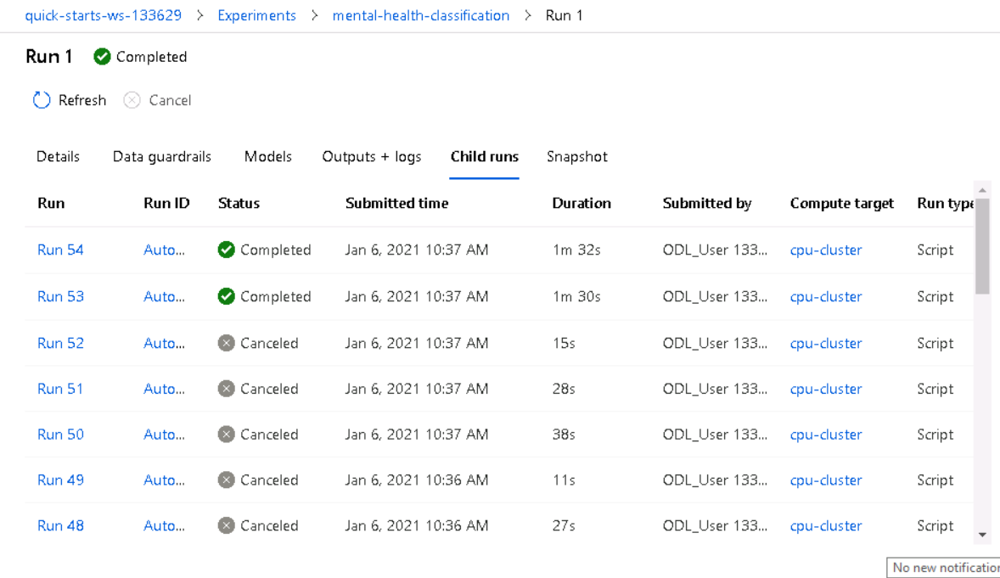

# Mental Health Classification

This mental health classification project is based on [this competition](https://zindi.africa/competitions/basic-needs-basic-rights-kenya-tech4mentalhealth) that was hosted on Zindi. I want to classify statements and expressions of university students into four mental health categories; depression, suicide, alcohol and drugs. This could be useful in providing quick services online such as in chatbots. 

Unlike in the competition, I generate the class predictions instead of the probabilities. 

## Project Set Up and Installation

1. Upload the data and notebooks and the train script in the notebook section of the ML studio. If you upload them in any other folder other than the default folder, make sure you change the path inside the notebooks.
2. Run

## Dataset

### Overview

The data is obtained from [this competition](https://zindi.africa/competitions/basic-needs-basic-rights-kenya-tech4mentalhealth). The statements were made in response to the question, “What is on your mind?”. It consists of three columns; id, text and the label.  The label is our target whereas text is the feature column. Train.csv consists of 616 observations, so it is a small dataste.

### Task

The task is to predict the label of the statements given from the four categories making it a classification problem. The text column will be used to generate features that will be used for training.

### Access

After the data has been uploaded to the workspace, I access the default datastore and then upload it there. After that, I create a Dataset from the files in the datastore which is then fed to the respective pipelines. 

## Automated ML

The settings and configurations used are explained below:

```
automl_settings = {
    "name": "AutoML_mental_health".format(time.time()),  #name 
    "enable_early_stopping" : True,  # save time and resources by stopping early if the model isn't improving
    "experiment_timeout_minutes" : 40, # maximum time the experimen is to take
    "iteration_timeout_minutes": 10,   # maximum time an iteration can take
    "n_cross_validations": 5,    # no of cross_validations to perform - didn't provide validation data
    "primary_metric": 'accuracy', # the metric that AutoML will optimize for model selection
    "max_concurrent_iterations": 10, #how many iterations can run at a time
}

# TODO: Put your automl config here
automl_config = AutoMLConfig(task="classification", #this is our goal, to classify
                             training_data=train_set, #the training data, a Dataset object
                             label_column_name="label", #our target column
                             compute_target=cpu_cluster, #created a cluster for it
                             debug_log='automl_errors.log', #file where the errors will be logged, useful in debugging
                             path=project_folder, #folder that contains 
                             model_explainability=True,
                             **automl_settings,
                            ) 
                            ```


### Results

 The best model was a Voting Ensemble model with a cv accuracy of 0.8646.  The ensemble implemented soft voting and had 12 estimators, one of them being Xgboost. It used a LabelEncoder to encode the label column and used botch character and word TFIDF to generate a total of 5190 features from the text column.


 50 different models were tried and ensemble models had the highest accuracy followed by XGBoost models and LightGBM respectively.




 The best model was a voting ensemble with an accuracy of 0.8646

To improve the AutoML model, we will need more data and do some advanced feature engineering on the text column such as getting the count of words etc.

## Hyperparameter Tuning

I used XGBoost Classifier, a boosted decision tree model, as it has proven to be performant and very fast. Also, it was one of the estimaors used in the besy model of the AutoML run. I chose to tune max_depth and n_estimators as they are the ones that usually make a huge difference in the results and have a wide range. 
* The **n_estimators** were among (200, 400, 500, 700, 1000) because through experiments considering the size of the datasets, they do perform pretty well. Another factor to consider was time as more estimators take more time to train.
* **max_depth** was between 2-7. I didn't go beyond 7 because that tends to overfit models.

I used RandomParameterSampling because it computationally and time efficient. The differences between random and grid sampling are discussed below.


### Results

The models had close results ranging from accuracy of 0.76 to 0.798. Models with higher estimators and max_depth performed poorly probably because of overfitting on the train dataset


The best model had an accuracy score of 0.798, with n_estimators as 500 and max_depth as 3.


The results from Hyperdrive could be improved by:
1. Adding more data so that the model can have a wide range to learn from.
2. Tuning other parameters such as sub_sample and reg_lamba(might help with overfitting).
3. Basic feature engineering such as removing punctuation, stop-words and lowercasing.
4. Advanced text feature engineering such as getting the count of words etc.

## Model Deployment
*TODO*: Give an overview of the deployed model and instructions on how to query the endpoint with a sample input.
I deployed the Automl model by first registering it then creating an ACI instance for it. 
To query the endpoint in a python environmnet see sample code below:
	```
	import requests
	import json

	input_data=json.dumps({"data": ["I am not feeling well"]})

	headers = {'Content-Type': 'application/json'}

	scoring_uri ="xxxxxx"  #obtain this from the consume section of the deployed model endpoint
	#alternatively if you are on the notebook that created the service, you can use  *scoring_uri = service.scoring_uri*

	resp = requests.post(scoring_uri, input_data, headers=headers)

	print("prediction:", resp.text) #this is your prediction
	```

  An active (Healthy) deployment of the model
 The best model deploy has succeeded from the models section of Azure ML

## Screen Recording
[YouTube Link](https://youtu.be/8PUd4A_N4ro)


## Standout Suggestions
I displayed the logs of the deployment which contains information on requests and the status of the deployed models such as if insights are enabled, when it was being initiated etc.

